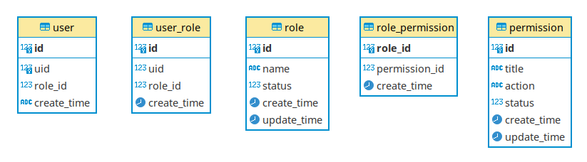

# 权限控制－概述

**基本概念**：

+ **认证**

  Identification，根据声明者所特有的识别信息，确认声明者的身份。

  一般是用户输入自己的唯一的认证信息（用户名密码、手机号验证码、二维码、指纹等）与服务端存储的用户信息做校对。

+ **鉴权**

  用户访问某些受权限控制保护的资源时，系统检查用户对这些资源的访问权限。

  比如校验上面 cookie-session、token（包括JWT）的合法性和有效性。

+ **授权**

  管理员赋予用户访问某些资源的权限。

  像cookie-session、token（包括JWT）也属于授权机制，赋予用户访问接口的权限。

+ **权限控制**

  权限控制是指对可执行的各种操作组合配置为权限列表，然后根据执行者的权限，若其操作在权限范围内，则允许执行，否则禁止。 

  包括三个要素：

  - 主体（Subject) 指主动对其它实体施加动作的实体，如：管理员。
  
  - 客体(Object) 是被动接受其他实体访问的实体，如：要访问的某个文件。
  
  - 控制策略(Policy)为主体对客体的操作行为和约束条件，如：某个用户是否有对某个文件的访问权限。
  
    有的框架也称为Action。

**模型**：

+ **SSO** (Single Sign-on，统一身份认证)

  单点登录模型，即一次登录到处访问。

  + **CAS** (Central Authentication Service)

    是SSO的一种实现模型。

+ **ACL** (Access Control List, 权限控制列表)

  一种权限控制模型。

  每一个客体都配有一个列表，这个列表记录了主体对客体进行何种操作。当系统试图访问客体时，先检查这个列表中是否有关于当前用户的访问权限。如：

  ```yaml
  # 比如某个文件拥有以下用户及访问权限的记录列表
  Alice: read,write
  Bob: read
  ```

  典型场景：Linux文件系统 ACL、Zookeeper ACL。

+ **RBAC** (Role Based Access Control，基于角色的权限控制)

  一种权限控制模型。在用户和权限之间引入了角色（Role，是权限的集合）的概念，角色解耦了用户和权限之间的关系。

  角色/权限之间的变化比组（用户集合）/用户关系之间的变化相对要慢得多，减小了授权管理的复杂性。

  RBAC支持三个著名的**安全原则**：最小权限原则、责任分离原则和数据抽象原则

  - 最小权限原则：RBAC可以将角色配置成其完成任务所需的最小权限集合
  - 责任分离原则：可以通过调用相互独立互斥的角色来共同完成敏感的任务，例如要求一个计账员和财务管理员共同参与统一过账操作
  - 数据抽象原则：可以通过权限的抽象来体现，例如财务操作用借款、存款等抽象权限，而不是使用典型的读、写、执行权限

  RBAC分为４个层级：

  | 层级  | 角色层次 | 授权约束 | 说明                                                  |
  | ----- | -------- | -------- | ----------------------------------------------------- |
  | RBAC0 | 否       | 否       | 角色间不嵌套，授权时无约束                            |
  | RBAC1 | 是       | 否       | 角色间有嵌套，授权时无约束，即基于RBAC0引入了继承     |
  | RBAC2 | 否       | 是       | 角色间无嵌套，授权时有约束，即基于RBAC0引入了授权约束 |
  | RBAC3 | 是       | 是       | 角色间有嵌套，授权时有约束，整合了RBAC1和RBAC2        |

  > 角色间的嵌套：子层的角色**继承**父层的角色的**所有权限**
  >
  > 授权时的约束：按规则限制是否可以，如，某个用户授予某个角色，某个角色设置嵌套角色，等操作
  >
  > 约束示例：
  >
  > - 角色互斥，一个人具备某个角色，就不应该再被授予另一个角色
  > - 角色容量，一个角色能够授予的人数有上限，超出后不能再授予更多人
  > - 先决条件角色，仅当一个用户属于某个角色时，他才能被授予另一个角色
  > - 运行时排斥，一个用户可以同时具备两个角色，但是这两个角色同一时间只能激活一个角色使用

  RBAC基本数据模型：

  

  对应的功能：

  + 用户管理
    + 查询用户列表
    + 添加用户
    + 编辑用户
    + 设置用户角色
  + 角色管理
    + 查询角色列表
    + 添加角色
    + 编辑角色
    + 设置角色权限
  + 权限管理
    + 查询权限列表
    + 添加权限
    + 编辑权限

+ **ABAC** (Attribute Based Access Control，基于属性的访问控制模型)

  通过动态计算一个或一组属性是否满足某种条件来进行授权判断。可以按需实现不同颗粒度的权限控制，但定义权限时不易看出用户和对象间的关系。如果规则复杂，容易给管理者带来维护和追查带来麻烦。

  属性通常来说分为四类：

  - 用户属性（如用户年龄)
  - 环境属性（如当前时间）
  - 操作属性（如读取)
  - 对象属性（如一篇文章，又称资源属性）

+ **DAC**

  根据自主访问控制策略建立的一种模型，允许合法用户以用户或用户组的身份访问策略规定的客体，同时阻止非授权用户访问客体。拥有客体权限的用户，可以将该客体的权限分配给其他用户。

  典型场景：Linux默认的访问控制模型。

+ **MAC**

  典型场景：SELinux的访问控制模型。

**技术实现**：

+ **[Spring-Security](https://docs.spring.io/spring-security/reference/index.html)**

  Spring Security是一个提供[身份验证、授权](https://docs.spring.io/spring-security/reference/features/authentication/index.html)和[针对常见攻击的保护](https://docs.spring.io/spring-security/reference/features/exploits/index.html)的框架。它具有保护命令式应用程序和响应式应用程序的一流支持，是保护基于spring的应用程序的事实标准。

  和Spring无缝整合、提供全面的权限控制、重量级框架。

  [示例应用](https://github.com/spring-projects/spring-security-samples/tree/main)。

  [Servlet应用集成Spring-Security](https://docs.spring.io/spring-security/reference/servlet/index.html)。

  **框架模块**：

  + spring-security-core

    包含核心身份验证和访问控制类和接口、远程支持和基本配置api。

  + spring-security-remoting

    提供了与Spring Remoting的集成。

  + spring-security-web

    该模块包含过滤器和相关的网络安全基础设施代码。它包含任何具有 servlet API 依赖性的东西。如果您需要 Spring Security Web 身份验证服务和基于 URL 的访问控制，则需要它。

  + spring-security-config

    该模块包含安全名称空间解析代码和Java配置代码。如果使用Spring Security XML名称空间进行配置或使用Spring Security的Java配置支持，则需要它。

  + spring-security-ldap

    提供 LDAP 身份验证和配置代码。

  + spring-security-oauth2-core

    包含为 OAuth 2.0 授权框架和 OpenID Connect Core 1.0 提供支持的核心类和接口。

  + spring-security-oauth2-client

    包含 Spring Security 对 OAuth 2.0 授权框架和 OpenID Connect Core 1.0 的客户端支持。

  + spring-security-oauth2-jose

    包含 Spring Security 对 JOSE（Javascript 对象签名和加密）框架的支持。

  + spring-security-oauth2-resourece-server

    包含 Spring Security 对 OAuth 2.0 资源服务器的支持。

  + spring-security-acl

    包含一个专门的域对象 ACL 实现。

  + spring-security-cas

    包含 Spring Security 的 CAS 客户端集成。如果您想将 Spring Security Web 身份验证与 CAS 单点登录服务器一起使用，则应该使用它。

  + spring-security-test

  + spring-secuity-taglibs

  **对于RBAC的支持**：

  + 利用Ant表达式实现权限控制 [Expression-Based Access Control](https://docs.spring.io/spring-security/reference/servlet/authorization/expression-based.html)；
  + 利用授权注解结合SpEL表达式实现权限控制；
  + （自行实现）利用过滤器注解实现权限控制；
  + （自行实现）利用动态权限实现权限控制。

+ **[Shiro](https://shiro.apache.org/java-authentication-guide.html)**

  专注于易用性，轻量。

  仅从文档上看没有Spring-Security支持的那么全面，好像只支持RBAC，CAS都被剥离到了一个基于Shiro的项目。

  

+ **[Casbin](https://casbin.org/docs/overview)**

  一个支持各种访问控制模型的**授权库**（只管访问控制、不管身份认证），例如ACL，RBAC，ABAC；支持众多语言，最初用Go语言开发。

  Casbin中访问控制模型被抽象为基于PERM（Policy, Effect, Request, Matcher，即策略、效果、请求、匹配）的一个配置文件。

  特征：

  1. 支持允许和拒绝授权。
  2. 具有访问控制模型model和策略policy两个核心概念。
  3. 支持RBAC中的多层角色继承，不止主体可以有角色，资源也可以具有角色。
  4. 支持内置超级用户，如 `root` 或 `administrator`。 超级用户可以在没有明确权限的情况下做任何事情。
  5. 支持规则匹配的多个内置运营商。 For example, `keyMatch` can map a resource key `/foo/bar` to the pattern `/foo*`。
  6. 不负责身份认证（包括管理用户列表或角色列表）。

+ **[OAuth2](https://oauth.net/2/)**

  OAuth 2.0是用于**授权**的行业**标准协议**，第三方网站无需获取用户的用户名和密码即可申请授权获取用户的资源信息。

  Client Libraries：

  - [Spring Security](https://spring.io/projects/spring-security/)
  - [Restlet Framework (draft 30)](http://www.restlet.org/)
  - [ScribeJava](https://github.com/scribejava/scribejava)
  - [oauth2-essentials](https://github.com/dmfs/oauth2-essentials)
  - [Light Java Client](https://github.com/networknt/light-java/tree/master/client)
  - [Google OAuth Java Client](https://github.com/google/google-oauth-java-client)
  - [Pac4j](https://www.pac4j.org/)
  - [Nimbus](https://connect2id.com/products/nimbus-oauth-openid-connect-sdk)
  - [AppAuth for Android](https://github.com/openid/AppAuth-Android)

  Server Libraries：

  - [MitreID (with OpenID Connect)](https://github.com/mitreid-connect/OpenID-Connect-Java-Spring-Server)
  - [Restlet Framework (draft 30)](http://www.restlet.org/)
  - [Apache CXF](http://cxf.apache.org/)
  - [Tokens](https://github.com/zalando/tokens): Java library for conveniently verifying and storing OAuth 2.0 service access tokens.
  - [Light OAuth2 - The fastest, lightest and cloud native OAuth 2.0 microservices](https://github.com/networknt/light-oauth2)
  - [Pac4j](https://www.pac4j.org/)
  - [Keycloak](https://www.keycloak.org/)
  - [Nimbus](https://connect2id.com/products/nimbus-oauth-openid-connect-sdk)

